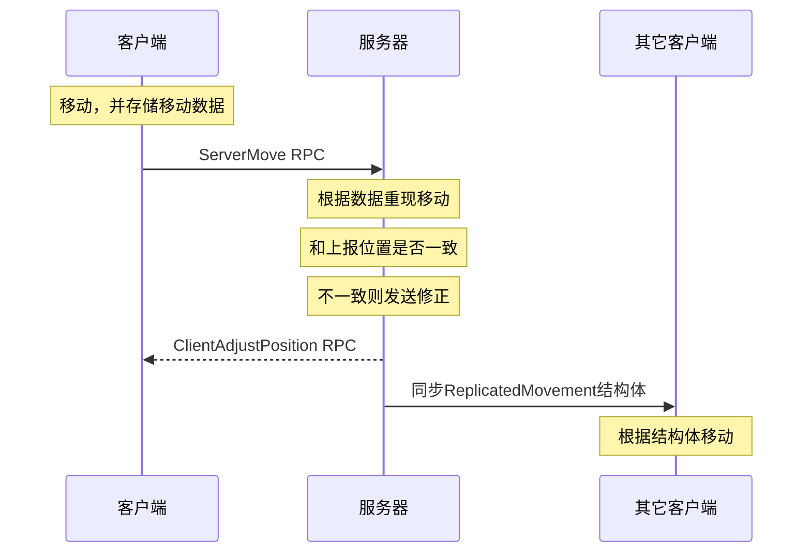

本文主要梳理UE官方文档对网络部分的介绍，对UE4网络有个基本的认识。

## 基本概念

解释UE4中出现的术语，对其基本概念进行解释，帮助理解。

### actor对象

actor对象可以在场景中生成和放置，是基本的游戏对象，常见的包括：actor，pawn，character。actor是基类，pawn，character依次继承，提供了更多的功能呢。ue4也是以组件（component）的形式对actor赋予更多的功能。

### 蓝图类

游戏对象可以创建为蓝图类，也可创建为C++类。其本质是一样的，都可以看做c++类，不过蓝图可以图像化的方式编辑类。设置中打开`blueprint nativization`，引擎会自动将蓝图类编译成C++类。

### actor网络角色

一个replicated actor会同时在服务器和客服端创建，但分配不同的角色（role）。一般服务器actor的角色为`ROLE_Authority`，控制了actor的状态，并向客服端的actor同步状态信息。客服端为`ROLE_SimulatedProxy`或者`ROLE_AutonomousProxy`。介绍`ROLE_Authority`的同步消息，并在两帧同步消息中做平滑处理。

**在方法里判断角色来调用不同逻辑：**
```c++
//客服端服务器都会调用
void AshootCharacter::SetCurrentHealth(float healthValue)
{
	if (Role == ROLE_Authority)
	{
		CurrentHealth = FMath::Clamp(healthValue, 0.f, MaxHealth);
		OnHealthUpdate();}
	else {
		FString deathMessage = FString::Printf(TEXT("set CurrentHealth in client"));
		GEngine->AddOnScreenDebugMessage(-1, 5.f, FColor::Red, deathMessage);
	}
}
```

### actor链接

actor需要找到`owning connection`来进行消息同步。每个connection都会创建一个PlayerController。一个acotr的most outer owner如果是PlayerController。那这个actor也被同样的connection拥有。这个connection就是actor的`owning connection`。

### 游戏模式（game mode）

定义了游戏模式，也是个actor对象。所以也能通过actor的同步机制来同步游戏状态（Game state）。

## 服务器模式

ue4用client-server的模式实现服务器。分为监听服务器（Listen server）和专用服务器dedicated server。监听服务器选择其中一个玩家作为服务器。专用服务器，没有client玩家，只允许服务器相关代码，性能更高。底层支持TCP，UDP协议。默认为UDP协议。

服务器和客服端公用一套代码，个人认为不利于前后端分工和后端调优，适合前后端不分工的开发模式。

官方建议，除非你完完全全确定这个项目不需要多人功能，最好按照多人模式编码。后期再加入多人功能可能需要重构整个代码。

## 状态同步

ue4用replication来同步游戏的状态，主要以actor为单位来同步。可以分为自动变量同步和手动RPC调用。

### 变量同步

对变量或者object的引用，指定为replicated，就会自动同步变量的值。但只能由服务器向客户端更新。值得更新是可靠的。如果属性值快速变化，不会将每个变化值同步，而会优化为只同步最终的值。

通过对变量注解来表明变量replication，有replicated，reqNotify两种。reqNotify，当变量变化时，还能调用额外的通知方法。

在注册变量replication的时候，可以调用`DOREPLIFETIME_CONDITION`加入额外的同步条件制属性如何更新。但只能有限的控制。ue4在更多的控制和更好的性能中做了平衡。

**Variable Replication in C++：**

```c++
class ENGINE_API AActor : public UObject
{
    /** The player's current health. When reduced to 0, they are considered dead.*/
    UPROPERTY(ReplicatedUsing = OnRep_CurrentHealth)
    float CurrentHealth;

    UPROPERTY(replicated )
    AActor * owner;
    /** RepNotify for changes made to current health.   the server will not receive the RepNotify.*/
    UFUNCTION()
    void OnRep_CurrentHealth();
};

void AActor::GetLifetimeReplicatedProps( TArray< FLifetimeProperty > & OutLifetimeProps ) const
{
    DOREPLIFETIME( AActor, owner );
    //增加条件，减少更新的频率，降低带宽
    DOREPLIFETIME_CONDITION( AActor, CurrentHealth, COND_SimulatedOnly );

}
```

### RPC

RPC分为可靠和不可靠。不重要的信息可以选择用不可靠的RPC来发送，已达到更好的性能，比如每帧都在改变的移动数据。

RPC有三种形式：`Client`，服务器向客服端调用；`Server`，客服端向服务器调用；`NetMulticast`，服务器向所有连接客服端调用。

服务端调用的RPC可以增加Validation函数来检查客服端的参数是否合法，返回bool值来确定是否调用。防止外挂的非法调用

```c++
//Declaration of Server RPC MyFunction.
UFUNCTION(Server, Reliable, WithValidation)
void MyFunction(int myInt);

//Implementation of Server RPC MyFunction.
void AExampleClass::MyFunction_Implementation(int myInt)
{
    //Gameplay code goes here.
}

//Validation of Server RPC MyFunction
bool AExampleClass::MyFunction_Validation(int myInt)
{
    /* 
        If the value of myInt is negative, we do not want to allow MyFunction_Implementation to run. 
        Therefore we only return true if myInt is greater than zero.
    */
    return myInt >= 0;
}
```

### component replication

静态组件默认都会在服务器和客服端创建。只有当组件的属性和事件需要同步的时候，才用设置replication。

组件同步的代价相对小。Each component within an Actor that replicates will add an additional NetGUID (4 bytes) 'header' and an approximately 1 byte 'footer' along with its properties

Cosmetic components like the Character's Skeletal Mesh and its Animation Blueprint are not replicated


## 相关性（Relevancy）

actor的相关性的检测，应该是减少带宽最明显的方式。场景有时候会包含有非常多的actor，但实际上只有小部分的actor会影响到玩家。我们需要检测每个actor的相关性，剔除不相关的actor，只同步会对玩家造成影响的actor，来大大减少带宽。

UE4在`AActor::IsNetRelevantFor()`对相关性检测做了默认实现，可以看到主要是用距离检测来做actor剔除。

UE4每帧会调用`UNetDriver::ServerReplicateActors`（`NetworkDriver.cpp`）。对所有的actor做相关性检测，最后调用`UChannel::ReplicateActor`将相关actor变化的值发送到对应的链接。

```c++
bool AActor::IsNetRelevantFor(const AActor* RealViewer, const AActor* ViewTarget, const FVector& SrcLocation) const
{
    .....
	return !GetDefault<AGameNetworkManager>()->bUseDistanceBasedRelevancy ||
			IsWithinNetRelevancyDistance(SrcLocation);
}
```

## 移动同步

角色移动组件实现了角色一些常见的移动方式。包括走路，跳，游泳，飞，也可以整合自定义移动方式。

`PerformMovement`函数负责角色的物理移动，会根据不同的移动方式调用对应的physics函数来计算角色的速度和加速度。

组件会在每帧调用`TickComponent`总，计算移动的

**角色移动情景：**


----- 
 
## 参考

>1. Networking and Multiplayer: https://docs.unrealengine.com/en-US/Gameplay/Networking/index.html