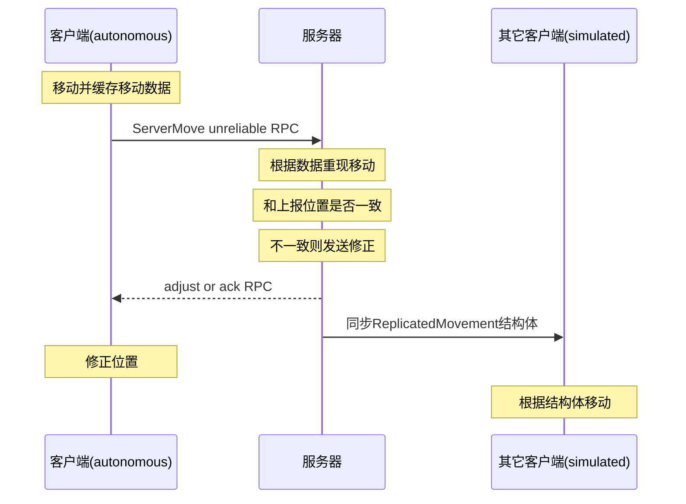

本文主要阅读UE4官方文档对[网络和多人游戏部分](https://docs.unrealengine.com/en-US/Gameplay/Networking/index.html)的介绍后的梳理和总结，希望能对UE4的多人游戏有个基本的认识。水平有限，欢迎指正。

## 1. 基本概念

刚开始阅读UE4文档，会对其中的许多专业术语感到迷惑。所以首先简单解释UE4中出现的术语，帮助理解。

### actor对象

actor对象可以在场景中生成和放置，是基本的游戏对象，常见的包括：actor，pawn，character。actor是基类，pawn，character依次继承，提供了更多的功能呢。ue4也是以组件（component）的形式对actor赋予更多的功能。

### 蓝图类

游戏对象可以创建为蓝图类，也可创建为C++类。其本质是一样的，都可以看做c++类，不过蓝图可以图像化的方式编辑类。设置中打开`blueprint nativization`，引擎会自动将蓝图类编译成C++类。

### actor网络角色

一个replicated actor会同时在服务器和客户端创建，但分配不同的角色（role）。一般服务器actor的角色为`ROLE_Authority`，控制了actor的状态，并向客户端的actor同步状态信息。客户端为`ROLE_SimulatedProxy`或者`ROLE_AutonomousProxy`。

remote role是actor在对应远端机器上对应的角色。比如在服务器上actor，Role == ROLE_Authority，RemoteRole == ROLE_SimulatedProxy。

因为ue4客户端和服务器是公用一套代码，所有经常需要判断角色来执行代码。
**通过判断角色执行服务器代码和客户端代码：**
```c++
//客户端服务器都会调用
void AshootCharacter::SetCurrentHealth(float healthValue)
{
	if (Role == ROLE_Authority)
	{
		CurrentHealth = FMath::Clamp(healthValue, 0.f, MaxHealth);
		OnHealthUpdate();}
	else {
		FString deathMessage = FString::Printf(TEXT("set CurrentHealth in client"));
		GEngine->AddOnScreenDebugMessage(-1, 5.f, FColor::Red, deathMessage);
	}
}
```

### actor链接

actor需要找到对应的连接（`owning connection`）来进行消息同步。每个connection都会创建一个PlayerController。一个acotr的most outer owner如果是PlayerController。那这个actor也被同样的connection拥有。这个connection就是actor的连接。

### 游戏模式和游戏状态

游戏模式在GameMode类中定义，定义了对客户端不可见的游戏规则。在多人模式中，GameMode只会存在服务器中。游戏状态在GameState类中定义，同时存在客户端和服务器，能同步游戏中的状态。它们都继承自actor。

## 2. 服务器模式

ue4用client-server的模式实现服务器。底层支持TCP，UDP协议。默认为UDP协议。分为下面两类：
- 监听服务器（Listen server）：即作为玩家，也作为服务器。
- 专用服务器（dedicated server）：没有client玩家，只执行服务器相关代码，性能更高。

服务器和客户端公用一套代码，适合前后端不分工的开发模式，能快速开发出游戏。但不利于前后端分工和后端调优。

除非完完全全确定这个项目不需要多人功能，最好按照多人模式编码。避免后期再加入多人功能可能需要重构整个代码。

## 3. 状态同步

ue4用replication来在服务器和客户端之间同步游戏的状态，主要以actor为单位来同步。可以分为自动变量同步和手动RPC调用。

### 变量同步

对变量或者object的引用，指定为replicated，就会由服务器向客户端自动同步变量的值。值得更新是可靠的。如果属性值快速变化，不会将每个变化值同步，而会优化为只同步最终的值。

通过对变量注解来表明变量replication，有replicated，reqNotify两种。reqNotify，当变量变化时，还能调用额外的通知方法。变量变化之前的值可以通过`preNetReceive`来缓存。

在注册变量replication的时候，可以调用`DOREPLIFETIME_CONDITION`加入额外的同步条件制属性如何更新。但只能有限的控制。ue4在更多的控制和更好的性能中做了平衡。

如何要获取变量变化之前的值，可以在`PreReplication`方法中缓存变量更新之前的值。

**Variable Replication in C++：**

```c++
class ENGINE_API AActor : public UObject
{
    /** The player's current health. When reduced to 0, they are considered dead.*/
    UPROPERTY(ReplicatedUsing = OnRep_CurrentHealth)
    float CurrentHealth;

    UPROPERTY(replicated )
    AActor * owner;
    /** RepNotify for changes made to current health.   the server will not receive the RepNotify.*/
    UFUNCTION()
    void OnRep_CurrentHealth();
};

void AActor::GetLifetimeReplicatedProps( TArray< FLifetimeProperty > & OutLifetimeProps ) const
{
    DOREPLIFETIME( AActor, owner );
    //增加条件，减少更新的频率，降低带宽
    DOREPLIFETIME_CONDITION( AActor, CurrentHealth, COND_SimulatedOnly );
}
```

### RPC

除了变量同步还可以手动调用RPC来同步消息。RPC有三种形式：
- Client，服务器向客户端调用。
- Server，客户端向服务器调用，只有automonous的能调用。
- NetMulticast，服务器向所有连接客户端调用。

RPC分为可靠和不可靠。可靠的RPC会将消息压入队列，如果网络情况太差，队列数量超过阈值会断开连接。尽量选用不可靠的RPC已达到更好的性能。

服务端调用的RPC可以增加Validation函数来检查客户端的参数是否合法，不合法返回false断开客户端连接，防止外挂的非法调用。

**RPC in C++：**
```c++
class AExampleClass{
    //Declaration of Server RPC MyFunction.
    UFUNCTION(Server, Reliable, WithValidation)
    void MyFunction(int myInt);
}

//Implementation of Server RPC MyFunction.
void AExampleClass::MyFunction_Implementation(int myInt)
{
    //Gameplay code goes here.
}

//Validation of Server RPC MyFunction
bool AExampleClass::MyFunction_Validation(int myInt)
{
    return myInt >= 0;
}
```
### actor组件同步（component replication）

静态组件默认都会在服务器和客户端创建。只有当组件的属性和事件需要同步的时候，才用设置replication。

组件同步会有额外的消耗，需要包括额外`NetGUID`。在角色移动组件可以看到，移动组件通过组件的ower来代理RPC以减少组件RPC带来的额外消耗。

### Online Beacon

特殊的actor，提供和服务器更轻量的交互。可以在游戏中请求其它玩家的名字列表，游戏的进行时间等。具体的介绍文档很少，只有深入底层实现才能更好的描述使用场景。

### 角色移动同步

ue4在角色移动组件里实现了一套角色移动的同步，大大方便开发多人游戏。实现了一些常见的移动方式：走路，跳，游泳，飞，也可以整合自定义移动方式。

**角色移动情景如下：**


一个角色的移动在主控端（autonomous proxy）和其它端（simulated proxies）的同步方式是不一样的。其他端相对比较简单，只需要保持更新角色位置就行了。而主控端必须在位置修正和玩家平滑体验找到最佳平衡点。

角色的移动同步，有大量可以调节的参数和可以重载的方法。包括位置同步频率，误差允许范围，位置修正频率，移动插值方法等。对于特定的项目，应该基于项目的特点，调整参数甚至重写方法。既保证客户端体验又保证服务器性能。


## 4. 相关优化

在大型多人游戏里，一个场景会有多个连接和很多需要同步的actor，对服务器的带宽和cpu都有非常大的压力，ue4文档介绍了如下的几种优化方法。

### 相关性（Relevancy）

actor的相关性的检测，应该是减少带宽最明显的方式。场景有时候会包含有非常多的actor，但实际上只有小部分的actor会影响到指定玩家。我们需要检测每个actor的相关性，剔除不相关的actor，只同步会对玩家造成影响的actor，来大大减少带宽。

UE4每帧会调用`UNetDriver::ServerReplicateActors`（`NetworkDriver.cpp`）对所有的actor做相关性检测，最后只将相关actor变化的值调用`UChannel::ReplicateActor`发送到对应的链接。

UE4在`AActor::IsNetRelevantFor()`对相关性检测做了默认实现，可以除了按照相关性配置进行检查，然后用距离检测来做actor剔除。

```c++
bool AActor::IsNetRelevantFor(const AActor* RealViewer, const AActor* ViewTarget, const FVector& SrcLocation) const
{
    if (bAlwaysRelevant || IsOwnedBy(ViewTarget) || IsOwnedBy(RealViewer) || this == ViewTarget || ViewTarget == GetInstigator())
	{
		return true;
	}
	else if (bNetUseOwnerRelevancy && Owner)
	{
		return Owner->IsNetRelevantFor(RealViewer, ViewTarget, SrcLocation);
	}
	else if (bOnlyRelevantToOwner)
	{
		return false;
	}
    .....
	return !GetDefault<AGameNetworkManager>()->bUseDistanceBasedRelevancy ||
			IsWithinNetRelevancyDistance(SrcLocation);
}
```
### 优先级

每个actor都能分配网络优先级，优先级越高，就会相比其他actor占用更多的网络带宽。优先级高的actor更可能被同步。

网络优先级在`AActor::GetNetPriority`中进行计算。避免在极端情况，某些低优先级的actor永远得不到更新，网络优先级还会乘以等待actor等待同步的时间。同时网络优先级还会考虑actor和玩家的距离和位置。


### 同步图（replication graph）

replication graph将角色根据游戏和角色的特点，动态的分离到不同的组。这样在更新的时候对每个客户端不用遍历所有的actor来判断相关性，以节省CPU的消耗。

根据具体的游戏特点，会有多种不同的优化方法：
- 比如格子地图，可以根据actor在哪个格子，分配到不同的组。
- 将休眠的actor（在和玩家交互前都不需要同步），分配在单独的组。
- 如果能拾起或者穿戴actor，在穿戴后将他们放在一个组。
- 将所有可见或所有不可见的actor，单独成组。


## 5. 感受

通过ue4自带的同步框架，能够快速搭建出多人游戏，但是前后端的代码混在一起却不利于前后端的分工和后端的优化。除了状态同步之外，ue4引擎没有现成的数据库和缓存架构，单一的client-server的服务器架构，缺少服务器间的调用。如果要完成大型多人游戏，还需要为ue4填充额外的功能。

----- 
 
**参考**

>1. 官网文档Networking and Multiplayer: https://docs.unrealengine.com/en-US/Gameplay/Networking/index.html
>2. 数天ue4课程：http://school.digisky.com/home/course?id=12
>3. example: https://docs.unrealengine.com/en-US/Resources/Showcases/BlueprintMultiplayer/index.html
>4. onelin beacon: https://forums.unrealengine.com/community/community-content-tools-and-tutorials/1355434-onlinebeacons-tutorial-with-blueprint-access

