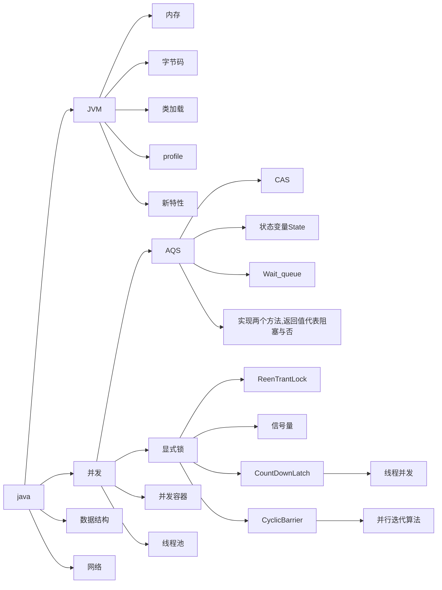

# java

```mermaid
graph LR;
    java-->JVM;
    java-->并发;
    java-->数据结构;
    java-->网络;
    JVM-->内存;
    JVM-->字节码;
    JVM-->类加载;
    JVM-->profile;
    JVM-->新特性;

    并发-->显式锁;
    并发-->AQS;
    并发-->并发容器;
    并发-->线程池;

    AQS-->CAS;
    AQS-->状态变量State;
    AQS-->Wait_queue;
    AQS-->实现两个方法,返回值代表阻塞与否;
    显式锁-->ReenTrantLock;
    显式锁-->信号量;
    显式锁-->CountDownLatch;
    显式锁-->CyclicBarrier;
    CountDownLatch-->线程并发;
    CyclicBarrier-->并行迭代算法;

```
