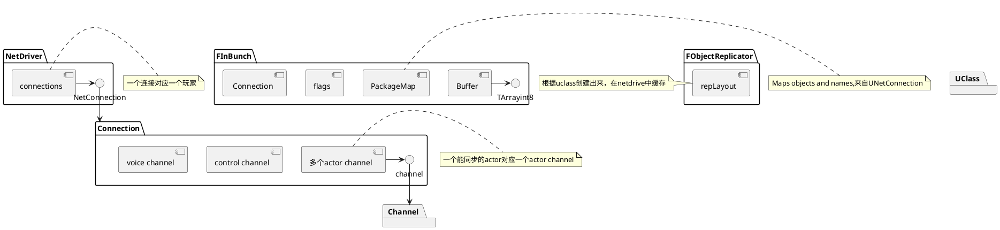
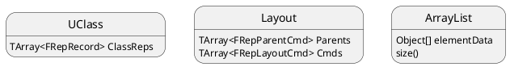
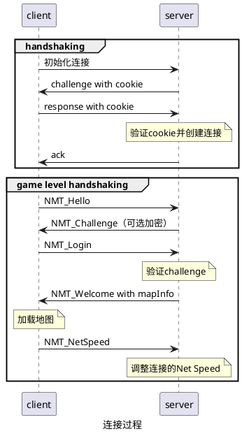
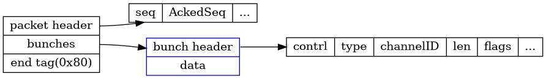
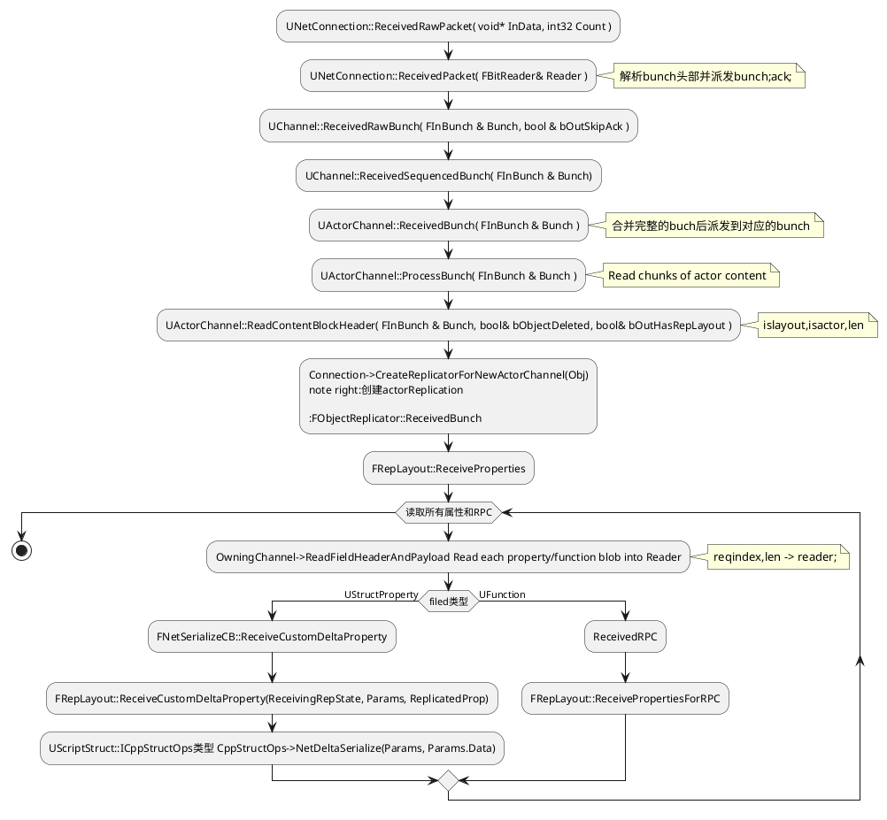

## 网络组件

### NetDriver，Connection，Channel

`NetDriver`是网络处理的核心，有三种类型的Driver：

- The Game NetDriver：负责主要的游戏网络交换
- The Demo NetDriver：记录数据，不会发送数据，用于回放重播系统。
- The Beacon NetDriver, responsible for network traffic that falls outside of "normal" gameplay traffic.

通常一个游戏，服务器只有一个Game NetDriver，NetDriver管理NetConnection列表，一个NetConnection就是一个玩家。Netconnection负责同步玩家所有channel的数据，包括Ac一个语音数据channel，一个控制channel，所以同步actor的channel。

FObjectReplicator:属性同步的执行器，每个Actorchannel对应一个FObjectReplicator，每一个FObjectReplicator对应一个对象实例。设置ActorChannel通道的时候会创建出来。





### Net Serializtion

 *		Everything originates in UNetDriver::ServerReplicateActors.
 *		Actors are chosen to replicate, create actor channels, and UActorChannel::ReplicateActor is called.
 *		ReplicateActor is ultimately responsible for deciding what properties have changed, and constructing an FOutBunch to send to clients.

 检测变量改变分为值类型数据和指针类型数据。
值类型，可以直接比较`Recent[]`然后用NetSerialize
指针类型，用NetDeltaSerialize比较状态和序列化。base state，delta state（发给客户端），full state（保存）。

有两种类型的`delta序列化`：generic Repication和fast array replication

### replayout

replayout管理所有UClass, UStruct, or UFunction的同步properties。用来读写比较属性的状态`FRepState`。一个类型对应一个FRepLayout，所有同样类型的实例共享一个FRepLayout。所有的属性在Replayout中被当做`Layout Commands`。分为Parent Command和Child Command。

属性只能从服务器同步到客户端。两边保持了不同的状态。`FSendingRepState`,`FReceivingRepState`。

changelist，可以知道两帧之间，改变了的属性。


### netguid

通过netguid来在服务器和客户端来标示对象的引用。在actor的相关性变化的时候，可能会发生多次mapping和unmapping。

### int
跟protobuf的Varinet一样。用1位来代表时候有更多的字节。

### FSocket和SocketSubSystem

FSocket是对网络底层的封装，对于上层需要的网络状态查询、发包、收包这些操作，全部都封装在了这里。屏蔽了与平台相关的底层。


## 初始化，建立连接

当服务器加载地图（UEngine::LoadMap），就会调用`UWorld::Listen`监听端口。客服端就可以连接服务器了。`SocketSubsystem->CreateSocket()`根据所在平台，创建socket。`FSocket`来包装socket，提供跨平台。

在`UIpNetDriver::InitBase`中创建socket，并设置socket属性，发生接收buffer大小，开启广播，非阻塞等，最后绑定端口。对于UDP来说，绑定端口就是

`UNetDriver::TickDispatch` 负责接收网络数据，根据数据包的地址来判断是否已经建立连接，还没建立连接的就会先进行握手。或者路由到对应connection`Connection->ReceivedRawPacket`

UDP容易受到各种DOS攻击，特别是伪装IP地址，所以需要握手来判断IP地址的合法性。UE4用无状态的handshake，避免欺骗包消耗服务器的内存。

**玩家登陆流程，包含两次握手**：


有时候，路由器会改变包的端口，收到还未握手的包，服务器会发送1个字节的回包，让其重新开启握手。

game level handshaking，用`NetControlMessage`完成。


### 传输

当connection收到packet的时候，会拆分的bunches列表，然后派分到对应的channel。

Example: Client RPC to Server.

- Client makes a call to Server_RPC.
- That request is forwarded (via NetDriver and NetConnection) to the Actor Channel that owns the Actor on which he RPC was called.
- The Actor Channel will serialize the RPC Identifier and parameters into a Bunch. The Bunch will also contain he ID of its Actor Channel.
- The Actor Channel will then request the NetConnection send the Bunch.
- Later, the NetConnection will assemble this (and other) data into a Packet which it will send to the server.
- On the Server, the Packet will be received by the NetDriver.
- The NetDriver will inspect the Address that sent the Packet, and hand the Packet over to the appropriate etConnection.
- The NetConnection will disassemble the Packet into its Bunches (one by one).
- The NetConnection will use the Channel ID on the bunch to Route the bunch to the corresponding Actor Channel.
-  ActorChannel will them disassemble the bunch, see it contains RPC data, and use the RPC ID and serialized arameters
    to call the appropriate function on the Actor.

每个包都有自增的序列号。
### 协议

`<<`根据具体的类，被重载为序列化或者反序列化。
```
uint32 FNetworkVersion::EngineNetworkProtocolVersion	= HISTORY_ENGINENETVERSION_LATEST;
uint32 FNetworkVersion::GameNetworkProtocolVersion		= 0;

uint32 FNetworkVersion::EngineCompatibleNetworkProtocolVersion		= HISTORY_REPLAY_BACKWARDS_COMPAT;
uint32 FNetworkVersion::GameCompatibleNetworkProtocolVersion		= 0;
```

packet是connection。bunch是channel。

`DataBunch.h`定义了bunch。


`FReceivedPacketView`:Represents a view of a received packet


先读出头`FNetPacketNotify::ReadHeader`：
```
	Data.Seq = FPackedHeader::GetSeq(PackedHeader);
	Data.AckedSeq = FPackedHeader::GetAckedSeq(PackedHeader);
	Data.HistoryWordCount = FPackedHeader::GetHistoryWordCount(PackedHeader) + 1;
```


**协议**：





FNetBitReader ：A bit reader that serializes FNames and UObject* through
 	a network packagemap.

packet header和bunch header随着版本变化，格式不一样。在`EEngineNetworkVersionHistory`定义了协议的历史版本号。

packet是用结束标示来识别完整的packet。应该是因为，UE4限制了包最大为MTU。所以基本不会有拆包的情况，收到包判断最后一个标志位大概率会直接成功。

packet可能包含0个或多个bunch。packet header包含对应链接信息，会路由到对应链接，

bunch有许多标志位。包括是否完整的Bunch，是否是可靠等。

### 消息收发流程

`World::Tick`来驱动整个游戏。

`net.UseRecvMulti`，`net.IpNetDriverUseReceiveThread`配置接收网络消息单独线程。不用game thread接收。因为udp协议，没有连接，也就不用多路复用。


`IpNetDriver`

 * End point data isn't directly handled by NetConnections. Instead NetConnections will route data to Channels.
 * Every NetConnection will have its own set of channels.
 *
 * Common types of channels:
 *
 *	- A Control Channel is used to send information regarding state of a connection (whether or not the connection should close, etc.)
 *	- A Voice Channel may be used to send voice data between client and server.
 *	- A Unique Actor Channel will exist for every Actor replicated from the server to the client.

`TUniquePtr`

## 反射
c++不支持原生的反射。UE4自己实现了一套反射系统。属性的定义在· ObjectBase.h·中有简单的注释，可以帮助理解它所代表的意思。

Unreal Build Tool (UBT) and Unreal Header Tool (UHT)来生产反射所需要的代码。存储在·per-module .generated.inl·和·per-header .generated.h·

可以通过类型，也可以通过对象，拿到对应的反射类。
```C++
UTypeName::StaticClass() 
Instance->GetClass() 
//遍历反射对象的属性
for (TFieldIterator<UProperty> PropIt(GetClass()); PropIt; ++PropIt)
{
	UProperty* Property = *PropIt;
	// Do something with the property
}
```

```C++
//////////////////////////////////////////////////////////////////////////
// Base class for mobile units (soldiers)

#include "StrategyTypes.h"
#include "StrategyChar.generated.h"

UCLASS(Abstract)

class AStrategyChar : public ACharacter, public IStrategyTeamInterface
{

	GENERATED_UCLASS_BODY()

	/** How many resources this pawn is worth when it dies. */
	UPROPERTY(EditAnywhere, Category=Pawn)
	int32 ResourcesToGather;

	/** set attachment for weapon slot */
	UFUNCTION(BlueprintCallable, Category=Attachment)
	void SetWeaponAttachment(class UStrategyAttachment* Weapon);

	UFUNCTION(BlueprintCallable, Category=Attachment)
	bool IsWeaponAttached();

	protected:

	/** melee anim */
	UPROPERTY(EditDefaultsOnly, Category=Pawn)
	UAnimMontage* MeleeAnim;

	/** Armor attachment slot */
	UPROPERTY()
	UStrategyAttachment* ArmorSlot;

	/** team number */
	uint8 MyTeamNum;

	[more code omitted]
};
```

The type hierarchy for the property system looks like this:
```
UField
	UStruct
		UClass (C++ class)
		UScriptStruct (C++ struct)
		UFunction (C++ function)

	UEnum (C++ enumeration)

	UProperty (C++ member variable or function parameter)

		(Many subclasses for different types)
```

## 属性同步

之前的惊奇游戏，修改属性后会把actor置为dirty。每帧更新的时候，会检查更新为dirty的actor所有属性。


## 结论

对网络注重性能优化，大部分优化从堡垒之夜而来。适合开发堡垒之夜类型的游戏。

## 参考
> 2. replayout.h netdriver.h netserializtion.h(自定义序列化 replayout 注释
> 1. https://blog.ch-wind.com/ue4-network-overview/
https://blog.uwa4d.com/archives/USparkle_Exploring.html

反射：https://zhuanlan.zhihu.com/p/60622181

https://www.unrealengine.com/zh-CN/blog/unreal-property-system-reflection