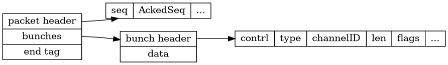

## 协议

一个完整的包就是一个packet。一个packet可能包含0个或多个bunch。bunch对应不同channel，多个channel的bunch会合并成一个packet发送。

**packet组成大致如下**：


packet header包含序列号和对应连接等信息，服务器根据信息路由到对应连接。bunch header有许多标志位。包括是否完整的Bunch，是否是可靠等。

packet是用结束标示来识别完整的packet。应该是因为UE4限制了包最大为MTU。所以基本不会有拆包的情况，收到包判断最后一个标志位大概率会直接成功。

packet header和bunch header随着版本变化，格式也可能发生变化。在`EEngineNetworkVersionHistory`定义了协议的历史版本号。

### bunch

可以看到，主要的数据都是通过bunch传输的。

## 序列化

FArchive重载`<<`来同时实现序列化和反序列化，当FArchive是写模式，`<<`为序列化方法；当Farchive是读模式，`<<`为反序列化方法。一个操作符干两件事，如果你刚开始看UE4代码会感觉比较困惑。


先读出头`FNetPacketNotify::ReadHeader`：
```
Data.Seq = FPackedHeader::GetSeq(PackedHeader);
Data.AckedSeq = FPackedHeader::GetAckedSeq(PackedHeader);
Data.HistoryWordCount = FPackedHeader::GetHistoryWordCount(PackedHeader) + 1;
```


**property system的类型继承：**
```
UField
	UStruct
		UClass (C++ class)
		UScriptStruct (C++ struct)
		UFunction (C++ function)

	UEnum (C++ enumeration)

	UProperty (C++ member variable or function parameter)
		(Many subclasses for different types)
```


用访问者模式为UField提供各种序列化方法。访问者为FArchive和其繁多的子类。
```
FArchive
	FBitArchive
		FBitReader
			FNetBitReader (serializes FNames and UObject* through a network packagemap.)
				FInBunch
		FBitWriter
			FNetBitWriter
				FOutBunch
	...
```

调用属性的`NetSerializeItem`方法序列化：

```c++


// This property changed, so send it
Cmd.Property->NetSerializeItem(TempWriter, TempWriter.PackageMap, const_cast<uint8*>(Data.Data));
uint32 NumBits = TempWriter.GetNumBits();
Writer.SerializeIntPacked(NumBits);
Writer.SerializeBits(TempWriter.GetData(), NumBits);
```

```c++
//
// Net serialization.
//
bool UProperty::NetSerializeItem( FArchive& Ar, UPackageMap* Map, void* Data, TArray<uint8> * MetaData ) const
{
	SerializeItem( FStructuredArchiveFromArchive(Ar).GetSlot(), Data, NULL );
	return 1;
}
//数字类型的Property
template<typename InTCppType, class TInPropertyBaseClass>
class COREUOBJECT_API TProperty_WithEqualityAndSerializer : public TProperty<InTCppType, TInPropertyBaseClass>
{
	virtual void SerializeItem(FStructuredArchive::FSlot Slot, void* Value, void const* Defaults) const override
	{
		Slot << *TTypeFundamentals::GetPropertyValuePtr(Value);
	}
};
```

### Net Serializtion

 *	Everything originates in UNetDriver::ServerReplicateActors.
 *	Actors are chosen to replicate, create actor channels, and UActorChannel::ReplicateActor is called.
 *	ReplicateActor is ultimately responsible for deciding what properties have changed, and constructing an FOutBunch to send to clients.

 检测变量改变分为值类型数据和指针类型数据。
值类型，可以直接比较`Recent[]`然后用NetSerialize
指针类型，用NetDeltaSerialize比较状态和序列化。base state，delta state（发给客户端），full state（保存）。

有两种类型的`delta序列化`：generic Repication和fast array replication

`DataBunch.h`定义了bunch。


`FReceivedPacketView`:Represents a view of a received packet

### RPC
UE4反射工具会对RPC函数的参数生成对应结构体。经过序列化后发送到服务器。
```c++
UFUNCTION(Server, Reliable)
void HandleFire(uint32 damage,uint32 power);
//自动生成的结构体
shootCharacter_eventHandleFire_Parms Parms;
Parms.damage=damage;
Parms.power=power;
ProcessEvent(FindFunctionChecked(NAME_AshootCharacter_HandleFire),&Parms);
```

```c++
//rpc 调用栈
 UObject::ProcessEvent( UFunction* Function, void* Parms )
  AActor::CallRemoteFunction( UFunction* Function, void* Parameters, FOutParmRec* OutParms, FFrame* Stack )
  UNetDriver::ProcessRemoteFunction(class AActor* Actor, UFunction* Function, void* Parameters, FOutParmRec* OutParms, FFrame* Stack, class UObject* SubObject )
	UNetDriver::ProcessRemoteFunctionForChannel(UActorChannel* Ch, const FClassNetCache* ClassCache, const FFieldNetCache* FieldCache, UObject* TargetObj, UNetConnection* Connection, UFunction* Function, void* Parms, FOutParmRec* OutParms, FFrame* Stack, const bool IsServer, const ERemoteFunctionSendPolicy SendPolicy)

	FNetBitWriter TempWriter( Bunch.PackageMap, 0 );
	TSharedPtr<FRepLayout> RepLayout = GetFunctionRepLayout( Function );
	RepLayout->SendPropertiesForRPC( Function, Ch, TempWriter, Parms );
	……
		FNetBitWriter TempBlockWriter( Bunch.PackageMap, 0 );
			Ch->WriteFieldHeaderAndPayload( TempBlockWriter, ClassCache, FieldCache, NetFieldExportGroup, TempWriter );
			ParameterBits = TempBlockWriter.GetNumBits();
			HeaderBits = Ch->WriteContentBlockPayload( TargetObj, Bunch, false, TempBlockWriter );
```

每次只要执行sendrawbunch就会设置TimeSensitive为true，tickupdate时就会触发flushnet。只要sendbuffer有数据就会触发lowlevelsend，最终调用socket发送数据。


FStructuredArchiveFormatter 接口。分为json和二进制`FBinaryArchiveFormatter`。经过一层包装，最好还是调用Farchive `<<`序列化对应值。

### SerializeIntPacked

跟protobuf的Varinet编码类似。用1位来代表时候有更多的字节。

FNetBitReader ：A bit reader that serializes FNames and UObject* through
 	a network packagemap.

## 压缩

You can leverage some quantization functionalities exposed by the engine such has Vector quantization and Quaternion quantization。

### struct
当RPC的参数或者同步的属性是Struct的时候。可以自定义序列化方法。将结构体压缩序列化后再发送。

```c++
USTRUCT()
struct FMyCustomNetSerializableStruct
{
	UPROPERTY()
	float SomeProperty;
 
	bool NetSerialize(FArchive& Ar, class UPackageMap* Map, bool& bOutSuccess);
}
 
template<>
struct TStructOpsTypeTraits<FMyCustomNetSerializableStruct> : public TStructOpsTypeTraitsBase2<FMyCustomNetSerializableStruct>
{
	enum
	{
		WithNetSerializer = true
	};
};
```

```c++
// Runtime/Core/Private/Math/UnrealMath.cpp
void FRotator::SerializeCompressed( FArchive& Ar )
{
	uint8 BytePitch = FRotator::CompressAxisToByte(Pitch);
	uint8 ByteYaw = FRotator::CompressAxisToByte(Yaw);
	uint8 ByteRoll = FRotator::CompressAxisToByte(Roll);

	uint8 B = (BytePitch!=0);
	Ar.SerializeBits( &B, 1 );
	if( B )Ar << BytePitch; else    BytePitch = 0;
        ....
	
	if( Ar.IsLoading() )
	{
		Pitch = FRotator::DecompressAxisFromByte(BytePitch);
		Yaw = FRotator::DecompressAxisFromByte(ByteYaw);
		Roll = FRotator::DecompressAxisFromByte(ByteRoll);
	}
}
```
用1bit来表示这个属性是否为0，不为0的属性才会写入字节流。

###  Fast TArray Replication

UE4实现对基本数据类型（int，float..）通用序列化方法，也对TArray实现了通用的增量序列化（delta serialization）

Custom net delta serialization is mainly used in combination with fast TArray replication

Basically, if you want to replicate a TArray efficiently, or if you want events to be called on client for adds and removal, just wrap the array into a ustruct and use FTR.  Here is what the code documentation says about FTR:

Fast TArray Replication is a custom implementation of NetDeltaSerialize that is suitable for TArrays of UStructs

```c++
/** Step 2: You MUST wrap your TArray in another struct that inherits from FFastArraySerializer */
USTRUCT()
struct FExampleArray: public FFastArraySerializer
{
	GENERATED_USTRUCT_BODY()

	UPROPERTY()
	TArray<FExampleItemEntry>	Items;	/** Step 3: You MUST have a TArray named Items of the struct you made in step 1. */

	/** Step 4: Copy this, replace example with your names */
	bool NetDeltaSerialize(FNetDeltaSerializeInfo & DeltaParms)
	{
	   return FFastArraySerializer::FastArrayDeltaSerialize<FExampleItemEntry, FExampleArray>( Items, DeltaParms, *this );
	}
};
```


```c++
/** Various types of Properties supported for Replication. */
enum class ERepLayoutCmdType : uint8
{
	DynamicArray			= 0,	//! Dynamic array
	Return					= 1,	//! Return from array, or end of stream
	Property				= 2,	//! Generic property

	PropertyBool			= 3,
	PropertyFloat			= 4,
	PropertyInt				= 5,
	PropertyByte			= 6,
	PropertyName			= 7,
	PropertyObject			= 8,
	PropertyUInt32			= 9,
	PropertyVector			= 10,
	PropertyRotator			= 11,
	PropertyPlane			= 12,
	PropertyVector100		= 13,
	PropertyNetId			= 14,
	RepMovement				= 15,
	PropertyVectorNormal	= 16,
	PropertyVector10		= 17,
	PropertyVectorQ			= 18,
	PropertyString			= 19,
	PropertyUInt64			= 20,
	PropertyNativeBool		= 21,
	PropertySoftObject		= 22,
	PropertyWeakObject		= 23,
};
```

### 实例

调用RPC发送一个uint32的数组。UE4是不会对uint32的数据做压缩的，也就是uint32的值再小也占4个字节。

```c++
const TArray<uint32> data = {0,1,2,3,4,5,6,7,8,9,10,11,10,9,8,7,6,5,4,3,2,1,0};
HandleFire(30.0f,data);
```


### netguid

通过netguid来在服务器和客户端来标示对象的引用。当actor的相关性变化的时候，可能会发生多次mapping和unmapping。

## 参考

http://www.aclockworkberry.com/custom-struct-serialization-for-networking-in-unreal-engine/

https://blog.csdn.net/mohuak/article/details/83027211
