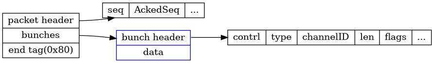

### 协议header

packet header和bunch header随着版本变化，格式不一样。在`EEngineNetworkVersionHistory`定义了协议的历史版本号。

packet是用结束标示来识别完整的packet。应该是因为，UE4限制了包最大为MTU。所以基本不会有拆包的情况，收到包判断最后一个标志位大概率会直接成功。

packet可能包含0个或多个bunch。packet header包含对应链接信息，会路由到对应链接，

bunch有许多标志位。包括是否完整的Bunch，是否是可靠等。


`<<`根据具体的类，被重载为序列化或者反序列化。
```
uint32 FNetworkVersion::EngineNetworkProtocolVersion	= HISTORY_ENGINENETVERSION_LATEST;
uint32 FNetworkVersion::GameNetworkProtocolVersion		= 0;

uint32 FNetworkVersion::EngineCompatibleNetworkProtocolVersion		= HISTORY_REPLAY_BACKWARDS_COMPAT;
uint32 FNetworkVersion::GameCompatibleNetworkProtocolVersion		= 0;
```

packet是connection。bunch是channel。

`DataBunch.h`定义了bunch。


`FReceivedPacketView`:Represents a view of a received packet


先读出头`FNetPacketNotify::ReadHeader`：
```
	Data.Seq = FPackedHeader::GetSeq(PackedHeader);
	Data.AckedSeq = FPackedHeader::GetAckedSeq(PackedHeader);
	Data.HistoryWordCount = FPackedHeader::GetHistoryWordCount(PackedHeader) + 1;
```

### netguid

通过netguid来在服务器和客户端来标示对象的引用。当actor的相关性变化的时候，可能会发生多次mapping和unmapping。


**协议**：


### 序列化


     
### Net Serializtion

 *	Everything originates in UNetDriver::ServerReplicateActors.
 *	Actors are chosen to replicate, create actor channels, and UActorChannel::ReplicateActor is called.
 *	ReplicateActor is ultimately responsible for deciding what properties have changed, and constructing an FOutBunch to send to clients.

 检测变量改变分为值类型数据和指针类型数据。
值类型，可以直接比较`Recent[]`然后用NetSerialize
指针类型，用NetDeltaSerialize比较状态和序列化。base state，delta state（发给客户端），full state（保存）。

有两种类型的`delta序列化`：generic Repication和fast array replication


The type hierarchy for the property system looks like this:
```
UField
	UStruct
		UClass (C++ class)
		UScriptStruct (C++ struct)
		UFunction (C++ function)

	UEnum (C++ enumeration)

	UProperty (C++ member variable or function parameter)

		(Many subclasses for different types)
```

用访问者模式，为UField提供各种序列化方法。在FArchive子类。

调用序列化属性：

```c++
// This property changed, so send it
Cmd.Property->NetSerializeItem(TempWriter, TempWriter.PackageMap, const_cast<uint8*>(Data.Data));
uint32 NumBits = TempWriter.GetNumBits();
Writer.SerializeIntPacked(NumBits);
Writer.SerializeBits(TempWriter.GetData(), NumBits);
```

```c++
//
// Net serialization.
//
bool UProperty::NetSerializeItem( FArchive& Ar, UPackageMap* Map, void* Data, TArray<uint8> * MetaData ) const
{
	SerializeItem( FStructuredArchiveFromArchive(Ar).GetSlot(), Data, NULL );
	return 1;
}
template<typename InTCppType, class TInPropertyBaseClass>
class COREUOBJECT_API TProperty_WithEqualityAndSerializer : public TProperty<InTCppType, TInPropertyBaseClass>
{
	virtual void SerializeItem(FStructuredArchive::FSlot Slot, void* Value, void const* Defaults) const override
	{
		Slot << *TTypeFundamentals::GetPropertyValuePtr(Value);
	}
};
```

FStructuredArchiveFormatter 接口。分为json和二进制`FBinaryArchiveFormatter`。经过一层包装，最好还是调用Farchive `<<`序列化对应值。

### SerializeIntPacked

跟protobuf的Varinet编码类似。用1位来代表时候有更多的字节。

FNetBitReader ：A bit reader that serializes FNames and UObject* through
 	a network packagemap.


http://www.aclockworkberry.com/custom-struct-serialization-for-networking-in-unreal-engine/

https://blog.csdn.net/mohuak/article/details/83027211
