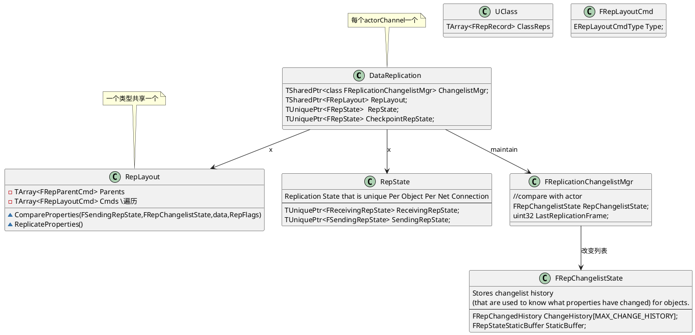
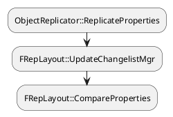
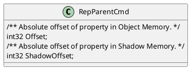

## 属性同步

之前的惊奇游戏，修改属性后会把actor置为dirty。每帧更新的时候，会检查更新为dirty的actor所有属性。

### replayout

replayout管理所有UClass, UStruct, or UFunction的同步properties。用来读写比较属性的状态`FRepState`。一个类型对应一个FRepLayout，所有同样类型的实例共享一个FRepLayout。所有的属性在Replayout中被当做`Layout Commands`。分为Parent Command和Child Command。

属性只能从服务器同步到客户端。两边保持了不同的状态。`FSendingRepState`,`FReceivingRepState`。

changelist，可以知道两帧之间，改变了的属性。

属性同步相关类：
- FObjectReplicator
属性同步的执行器，每个Actorchannel对应一个FObjectReplicator，每一个FObjectReplicator对应一个对象实例。设置ActorChannel通道的时候会创建出来。
- FRepState
针对每个连接同步的历史数据，记录同步前用于比较的Object对象信息，存在于FObjectReplicator里面。
- FRepLayOut
同步的属性布局表，记录所有当前类需要同步的属性，每个类或者RPC函数有一个。
- FRepChangedPropertyTracker
属性变化轨迹记录，一般在同步Actor前创建，Actor销毁的时候删掉。
- FReplicationChangelistMgr
存放当前的Object对象，保存属性的变化历史记录。当前属性与这里的属性对比。

### other
FRepShadowDataBuffer ShadowData = RepChangelistState->StaticBuffer.GetData();

shadowData和actor的属性进行比较。改变的序号存在`FRepChangelistState`，知道哪些属性改变了

acotr -> RepDataBufferBase

